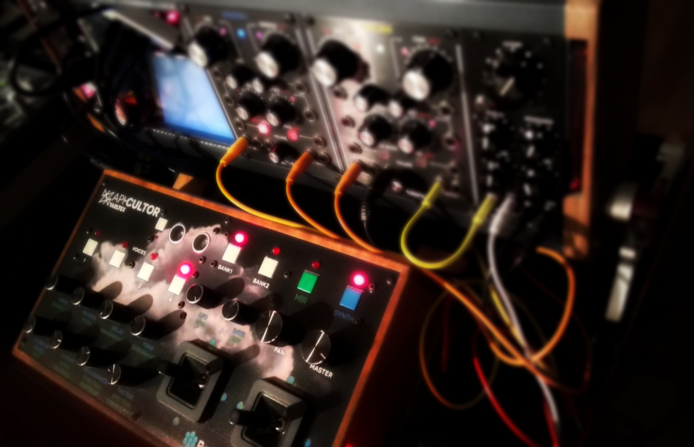

# Apicultor: Modular Music Information Retrieval Toolkit

[](https://www.python.org/downloads/)
[](https://www.gnu.org/licenses/gpl-3.0)
[](https://docs.python.org/3/library/typing.html)

**Apicultor** is a modular toolkit for **Music Information Retrieval (MIR)**, **sound analysis**, and **algorithmic composition**. It features a flexible plugin architecture that allows you to enable only the components you need, making it suitable for everything from research environments to embedded systems.

## ✨ Key Features

- 🧩 **Modular Plugin Architecture** - Enable/disable components as needed
- 🎵 **Music Information Retrieval** - Extract audio features and descriptors
- 🤖 **Machine Learning** - Sound similarity, clustering, and classification
- 🎭 **Emotion Analysis** - Music emotion recognition and generation
- 🎛️ **Real-time Performance** - Live coding with OSC/MIDI control
- 🌐 **Database Integration** - Freesound, RedPanal, and local file support
- 🔧 **Type Safe** - Full type annotations for robust development
- 📊 **Comprehensive Testing** - Extensive test coverage

## 🚀 Quick Start

### Installation

```bash
# Install from source
git clone https://github.com/sonidosmutantes/apicultor.git
cd apicultor
pip install -e .

# Or with Poetry
poetry install
```

### Basic Usage

```python
import apicultor

# Initialize with default plugins
plugin_manager = apicultor.initialize()

# Use database plugin to search for sounds
db_plugin = plugin_manager.get_plugin('database')
results = db_plugin.search_sounds("piano", limit=10)

# Use constraints plugin for optimization
constraints_plugin = plugin_manager.get_plugin('constraints')
constrained_values = constraints_plugin.apply_lower_bounds(data)
```

### Configuration

Create `apicultor_config.json`:

```json
{
  "plugins": {
    "enabled_modules": ["database", "constraints", "machine_learning"],
    "disabled_modules": ["emotion", "state_machine"],
    "plugin_configs": {
      "database": {
        "default_provider": "freesound",
        "freesound_api_key": "${APICULTOR_FREESOUND_API_KEY}"
      }
    }
  }
}
```

Or use environment variables:

```bash
export APICULTOR_ENABLED_MODULES="database,constraints,machine_learning"
export APICULTOR_FREESOUND_API_KEY="your_api_key"
```

## 🧩 Available Plugins

| Plugin | Description | Use Cases |
|--------|-------------|-----------|
| **database** | Sound database access (Freesound, RedPanal, local files) | Sound retrieval, corpus building |
| **analysis** | MIR feature extraction and descriptors | Audio analysis, feature vectors |
| **machine_learning** | Clustering, similarity, classification | Sound organization, recommendation |
| **emotion** | Music emotion analysis and generation | Affective computing, mood-based selection |
| **segmentation** | Audio segmentation algorithms | Structure analysis, boundary detection |
| **state_machine** | Markov chain composition and performance | Algorithmic composition, live coding |
| **constraints** | Mathematical optimization utilities | Machine learning, signal processing |
| **sonification** | Data-to-audio conversion | Scientific sonification, synthesis |
| **gradients** | Optimization algorithms | Deep learning, parameter tuning |

## 📖 Documentation

- **[Plugin System Guide](PLUGIN_SYSTEM.md)** - Complete guide to the modular architecture
- **[Installation Guide](INSTALL.md)** - Detailed installation instructions  
- **[Development Guidelines](doc/Dev-Guidelines.md)** - Contributing and development setup
- **[API Documentation](doc/API.md)** - Complete API reference

## 🎪 Interactive Demos

* **[Cloud Instrument](https://www.youtube.com/watch?v=SCYEEpfct_Y)** - Raspberry Pi + custom controller retrieving sounds using MIR descriptors
* **[Experimental Session](https://www.youtube.com/watch?v=2sMsKvfZKGA)** - Live demo with MIDI controller
* **[Embedded Instrument](https://github.com/hordiales/cloudpicultor_instrument)** - Running on Bela or Raspberry Pi

## 🏆 Recognition

* **ArCiTec Prize** - Technology Applied to Arts (2018)
* **NIPS 2017 Art Gallery** - Machine Learning for Creativity and Design
* **Audio Mostly 2017** - "Sound recycling from public databases" publication
* **Technarte Los Angeles 2017** - Conference presentation

## 🎵 Use Cases

### Research & Analysis
```python
# Enable analysis and ML plugins
export APICULTOR_ENABLED_MODULES="analysis,machine_learning,constraints"

# Extract features and cluster sounds
ml_plugin = plugin_manager.get_plugin('machine_learning')
clusters = ml_plugin.cluster_sounds(feature_vectors, n_clusters=5)
```

### Live Performance
```python
# Enable real-time performance plugins  
export APICULTOR_ENABLED_MODULES="database,state_machine,sonification"

# Create Markov chain composition
sm_plugin = plugin_manager.get_plugin('state_machine')
composition = sm_plugin.create_composition(sounds, transitions)
```

### Embedded/IoT
```python
# Minimal setup for embedded systems
export APICULTOR_ENABLED_MODULES="analysis,constraints"

# Lightweight audio analysis
analysis_plugin = plugin_manager.get_plugin('analysis')
features = analysis_plugin.extract_features(audio_data)
```

## 🎛️ Hardware Integration


Apicultor supports:
- **Custom MIDI controllers** (Yaeltex and others)
- **OSC communication** for networked performance
- **Raspberry Pi** deployment for embedded instruments
- **Bela Platform** for ultra-low latency audio

## 🌐 Database Support

- **[Freesound.org](https://freesound.org)** - Collaborative sound database
- **[RedPanal.org](http://redpanal.org)** - Latin American sound platform  
- **Local Files** - Your own sound collections
- **Custom APIs** - Extensible database interface

## 🔬 Research Applications

Apicultor has been used in academic research:

- **Sound Recycling** - Automated discovery and reuse of online audio
- **Music Emotion Analysis** - Deep learning for affective music computing
- **Algorithmic Composition** - MIR-driven generative music systems
- **Interactive Performance** - Real-time sound manipulation and synthesis

## 🎨 Creative Projects

### Performances with Sonidos Mutantes
- **APICultor + No Input + Granular synthesis** - [Live performance](https://soundcloud.com/sonidosmutantes/apicultor-no-input)
- **Feature Thinking** - Generative music using MIR state machines
- **Banda de Mutantes** - Experimental sound workshops and performances

### Compositions
- **[API-Cultor compositions](http://redpanal.org/p/apicultor/)** - Sound recycling pieces
- **[Reciclado de samples](http://redpanal.org/p/reciclado-de-samples/)** - Creative Commons remixes

## 🛠️ Development

### Prerequisites
- Python 3.8+
- Poetry (recommended) or pip
- Optional: SuperCollider, Pyo, Pure Data

### Setup
```bash
git clone https://github.com/sonidosmutantes/apicultor.git
cd apicultor
poetry install --with dev

# Run tests
poetry run pytest

# Type checking
poetry run mypy src/

# Code formatting
poetry run black src/ tests/
```

### Contributing
1. Fork the repository
2. Create a feature branch
3. Add tests for new functionality
4. Ensure all tests pass and code is typed
5. Submit a pull request

See [Development Guidelines](doc/Dev-Guidelines.md) for detailed information.

## 📦 Deployment Scenarios

### Docker
```bash
docker build -t apicultor .
docker run -e APICULTOR_ENABLED_MODULES="database,analysis" apicultor
```

### Raspberry Pi
```bash
# Optimized for embedded systems
export APICULTOR_ENABLED_MODULES="analysis,constraints,sonification"
python -m apicultor.cli.run_analysis --input audio.wav
```

## 📄 License

This project is licensed under the **GNU General Public License v3.0** - see the [LICENSE](LICENSE) file for details.

## 👥 Authors

- **Hernán Ordiales** - Creator and maintainer
- **Marcelo Tuller (MarsCrop)** - MusicEmotionMachine branch
- **Community Contributors** - See [contributors](https://github.com/sonidosmutantes/apicultor/contributors)

## 🔗 Links

- **Website**: [Sonidos Mutantes](http://sonidosmutantes.github.io/)
- **RedPanal**: [Sound platform](http://redpanal.org)
- **Research**: [Publications and papers](https://www.researchgate.net/publication/317388443_Sound_recycling_from_public_databases)

## 🌟 Support

If you find Apicultor useful, please:
- ⭐ Star this repository
- 🐛 Report bugs and suggest features
- 📢 Share your projects using Apicultor
- 🤝 Contribute code, documentation, or examples

---

**APICultor** born to realize interdisciplinary performances based on sounds from web platforms. The system combines Music Information Retrieval (MIR) analysis, real-time processing, machine learning, and human control to create new forms of musical expression and sound art.

Spanish version: [README_es.md](README_es.md)

# News

## 2025 - Major Refactor & Modernization
* **Complete Architecture Overhaul**: Implemented modular plugin system with dependency injection
* **Type Safety**: Added comprehensive type annotations throughout the codebase using Python 3.8+ features
* **FFmpeg Integration**: Replaced subprocess calls with modern `ffmpeg-python` library for robust audio conversion
* **Database Modernization**: Updated RedPanalDB to use `requests` library with proper error handling and async support
* **Project Restructuring**: 
  - Moved audio-related modules (constraints, segmentation) under unified `/audio` directory
  - Removed legacy code from gradients, emotion, and machine_learning modules
  - Streamlined plugin discovery and configuration management
* **Configuration System**: New JSON-based configuration with environment variable support
* **Testing Infrastructure**: Added pytest framework with comprehensive test coverage and CI/CD support
* **Poetry Migration**: Migrated from setuptools to Poetry for modern Python dependency management

## 2018
* Migration to Python3 and setup.py install thanks to MarsCrop!
* MusicEmotionMachine by MarsCrop (in development)
* Cloud Instrument ready to play with an external controller, running in a dedicated device like Raspberry Pi or Bela Platform

## 2017
* SuperCollider patch to play in realtime using sounds from public repositories (databases on the web). Realtime synthesis, wav retrieving using MIR descriptors, OSC & MIDI communication between process and controllers.

## 2016
* First demos (extracting MIR features, database build, MIR State Machine, etc)

# Developers

See [Development Guidelines](doc/Dev-Guidelines.md).

# License

Free Software shared with GPL v3, see [LICENSE](LICENSE).

# Cloud Instrument

Using a desktop computer, a Raspberry pi or bela platform.

See [cloud_instrument/README.md](cloud_instrument/README.md)

Interactive __DEMO__: [Cloud Instrument](https://www.youtube.com/watch?v=SCYEEpfct_Y). Interactive demo retrieving sounds from the Cloud using MIR descriptors and processing them in realtime (using raspicultor aka raspberry pi + apicultor).



### UI
[Open Stage Control](https://osc.ammd.net/) User Interface


## Custom MIDI Controller design


[Yaeltex](https://yaeltex.com/en) custom MIDI controllers


With a SuperCollider synthesizer/effects processor running in a Raspberry pi, plus an external sound card for high fidelity.


## Performances

### Sonidos Mutantes

Interdisciplinary performances based on sounds of the web platform [Redpanal.org](Redpanal.org)

## Proofs of concept:

* [APICultor + No Input + Granular synthesis live performance](https://soundcloud.com/sonidosmutantes/apicultor-no-input).

* Compositions & recycled samples
  * [API-Cultor compositions](http://redpanal.org/p/apicultor/)
  * [Proyecto de reciclado de sonidos libres de la web en RedPanal.org](http://redpanal.org/p/reciclado-de-samples/) (sonido + referencia al original).

* Generative music using MIR state machine a free/libre sounds from Freesound.org: 
  * "[Feature Thinking](https://soundcloud.com/hern-n-ordiales/feature-thinking)" (with Creative Commons sounds from Freesound.org) by hordia.
  * State Machine @ CASo (Centro de Arte Sonoro) https://www.youtube.com/watch?v=sG1YUc8PQV4

* Live performances using this tool:
  * Jam con guitarras + fx chain y sintes analógicos: [Perfo mutante en La Siesta del Fauno](https://soundcloud.com/hern-n-ordiales/perfo-mutante-mobile)
  * Closing performance of the Workshop of Experimental Sound:
[http://redpanal.org/a/banda-de-mutantes-cierre-taller/](http://redpanal.org/a/banda-de-mutantes-cierre-taller/)
  * La Noche de los Museos La Casa del Bicentenario: [Performance 29/10/2016](http://redpanal.org/a/performance-casa-tomada/) [Con visuales 3D (Blender game engine)](https://www.youtube.com/watch?v=eKcvkgtJIEo) ) **Reseña**: [enjambrebit-y-la-banda-de-mutantes/](http://blog.enjambrelab.com.ar/enjambrebit-y-la-banda-de-mutantes/)

* "Remixes que toman audios libres de [RedPanal.org](http://redpanal.org/) para categorizarlos según diferentes tipos de emociones. Luego se elige una y se sincronizan las pistas, cambiando las tonalidades. De ser posible se separan de fuentes dentro de las mismas" (by Mars Crop)
  * [Beats intro jazz](http://redpanal.org/a/sm-beats-remix/)
  * [Bass & DJ] (http://redpanal.org/a/sm-bass-guitar-plays-with-dj/)


## Components

* Mock web service with API REST to provide audio samples using MIR descriptors as parameters
* State machine, with each state defined by several MIR descriptors.
* Interaction with the free internet sound database [http://redpanal.org](http://redpanal.org)
 * API REST
 * Webscrapping by tag
* Algorithms MIR to extract mean values or by frame of audio samples
* Segmentation algorithms using different criteria.
* Classify algorithms and clustering of samples of the sound database
* Server OSC
* Examples in Supercollider, pyo
* Examples with MIDI and OSC controller. Locale and remote.


# Dependencies

Tested under Linux, Mac OS (>10.11) and Windows 10.

Debian, Ubuntu 15.04 and 16.04 (and .10). And [Docker](docker/Docker.md) images.
Raspian @ Raspberry Pi

See [INSTALL.md](INSTALL.md)


