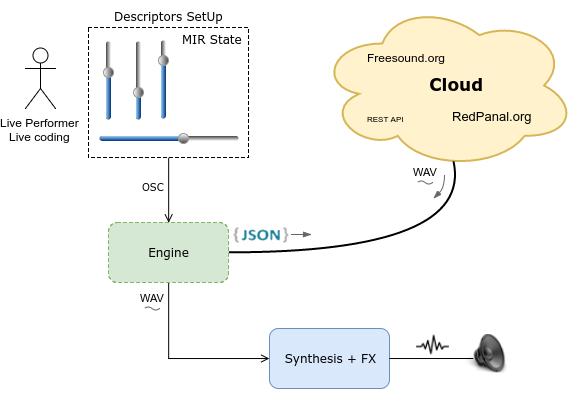
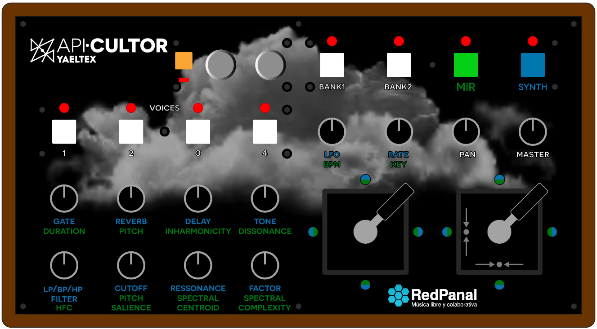
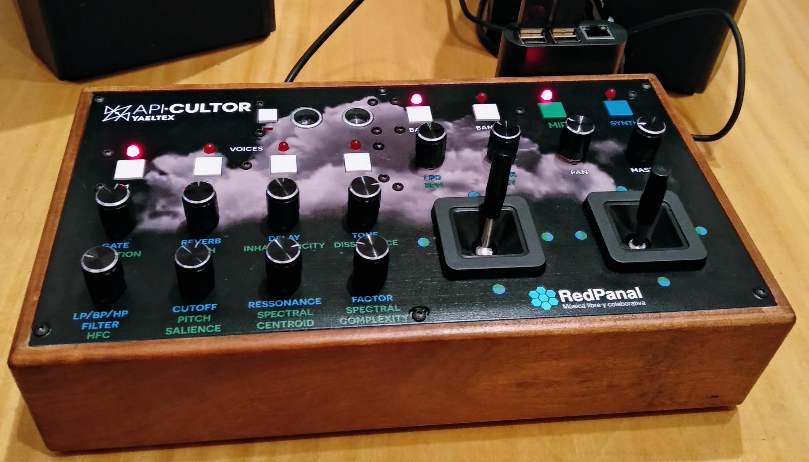
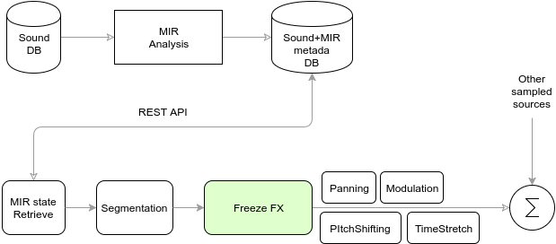

# About the project

* Interactive __DEMO__:
  * [Cloud Instrument](https://www.youtube.com/watch?v=SCYEEpfct_Y) raspicultor + custom controller version video. Interactive demo retrieving sounds from the Cloud using MIR descriptors and processing them in realtime (using raspicultor aka raspberry pi + apicultor).
  * [Experimental session with sounds from the cloud](https://www.youtube.com/watch?v=2sMsKvfZKGA). First live demo with an standard midi controller.
* Embedded instrument running in a [Bela](http://bela.io/) or Raspberry Pi: [cloudpicultor](https://github.com/hordiales/cloudpicultor_instrument).
* Cloud Instrument mention in [ArCiTec prize, Technology applied to Arts](https://arcitec.frba.utn.edu.ar/tecnologia-aplicada-al-arte/) (2018).
* Publication: [Sound recycling from public databases](https://www.researchgate.net/publication/317388443_Sound_recycling_from_public_databases) @ [Audio Mostly](http://audiomostly.com) 2017 
* "Forgotten pieces from unknown people" and "Dialectic in suspense" constructed using APICultor, were showed in [NIPS 2017 Art Gallery](http://nips4creativity.com/music/) (Machine Learning for Creativity and Design, Long Beach, California, USA)
* "Sound recycling from public databases" was presented at [Technarte Los Angeles 2017](http://www.technarte.org/losangeles-2017-program/).
* Recycled sounds: [Sound miniatures](http://redpanal.org/p/reciclado-de-samples/)

APICultor born to realize interdisciplinary performances based on sounds of the web platform [http://redpanal.org](http://redpanal.org). The system is also useful to use with any other sound database on the internet or even running it locally.

The sound is processed digitally using different live-coding techniques. A pre-analysis based on Music Information Retrieval (MIR) stored in a database and accessed via a web-service REST API is combined with real-time processing and synthesis, random processes and human control via external interfaces.

Examples available with SuperCollider, Pyo and pure data.

Spanish version: [README_es.md](README_es.md)

# News

* 2018
  * Migration to Python3 and setup.py install thanks to MarsCrop!
  * MusicEmotionMachine by MarsCrop (in development)
  * Cloud Instrument ready to play with an external controller, running in a dedicated device like Raspberry Pi or Bela Platform
* 2017: 
  * SuperCollider patch to play in realtime using sounds from public repositories (databases on the web). Realtime synthesis, wav retrieving using MIR descriptors, OSC & MIDI communication between process and controllers.
* 2016: First demos (extracting MIR features, database build, MIR State Machine, etc)

# Developers

See [Development Guidelines](doc/Dev-Guidelines.md).

# License

Free Software shared with GPL v3, see [LICENSE](LICENSE).

# Cloud Instrument

Using a desktop computer, a Raspberry pi or bela platform.

See [cloud_instrument/README.md](cloud_instrument/README.md)

Interactive __DEMO__: [Cloud Instrument](https://www.youtube.com/watch?v=SCYEEpfct_Y). Interactive demo retrieving sounds from the Cloud using MIR descriptors and processing them in realtime (using raspicultor aka raspberry pi + apicultor).

### UI
[Open Stage Control](https://osc.ammd.net/) User Interface

## Custom MIDI Controller design

[Yaeltex](https://yaeltex.com/en) custom MIDI controllers

With a SuperCollider synthesizer/effects processor running in a Raspberry pi, plus an external sound card for high fidelity.

## Performances

### Sonidos Mutantes

Interdisciplinary performances based on sounds of the web platform [Redpanal.org](Redpanal.org)

## Proofs of concept:

* [APICultor + No Input + Granular synthesis live performance](https://soundcloud.com/sonidosmutantes/apicultor-no-input).

* Compositions & recycled samples
  * [API-Cultor compositions](http://redpanal.org/p/apicultor/)
  * [Proyecto de reciclado de sonidos libres de la web en RedPanal.org](http://redpanal.org/p/reciclado-de-samples/) (sonido + referencia al original).

* Generative music using MIR state machine a free/libre sounds from Freesound.org: 
  * "[Feature Thinking](https://soundcloud.com/hern-n-ordiales/feature-thinking)" (with Creative Commons sounds from Freesound.org) by hordia.
  * State Machine @ CASo (Centro de Arte Sonoro) https://www.youtube.com/watch?v=sG1YUc8PQV4

* Live performances using this tool:
  * Jam con guitarras + fx chain y sintes analógicos: [Perfo mutante en La Siesta del Fauno](https://soundcloud.com/hern-n-ordiales/perfo-mutante-mobile)
  * Closing performance of the Workshop of Experimental Sound: [http://redpanal.org/a/banda-de-mutantes-cierre-taller/](http://redpanal.org/a/banda-de-mutantes-cierre-taller/)
  * La Noche de los Museos La Casa del Bicentenario: [Performance 29/10/2016](http://redpanal.org/a/performance-casa-tomada/) [Con visuales 3D (Blender game engine)](https://www.youtube.com/watch?v=eKcvkgtJIEo) ) **Reseña**: [enjambrebit-y-la-banda-de-mutantes/](http://blog.enjambrelab.com.ar/enjambrebit-y-la-banda-de-mutantes/)

* "Remixes que toman audios libres de [RedPanal.org](http://redpanal.org/) para categorizarlos según diferentes tipos de emociones. Luego se elige una y se sincronizan las pistas, cambiando las tonalidades. De ser posible se separan de fuentes dentro de las mismas" (by Mars Crop)
  * [Beats intro jazz](http://redpanal.org/a/sm-beats-remix/)
  * [Bass & DJ] (http://redpanal.org/a/sm-bass-guitar-plays-with-dj/)

## Components

* Mock web service with API REST to provide audio samples using MIR descriptors as parameters
* State machine, with each state defined by several MIR descriptors.
* Interaction with the free internet sound database [http://redpanal.org](http://redpanal.org)
 * API REST
 * Webscrapping by tag
* Algorithms MIR to extract mean values or by frame of audio samples
* Segmentation algorithms using different criteria.
* Classify algorithms and clustering of samples of the sound database
* Server OSC
* Examples in Supercollider, pyo
* Examples with MIDI and OSC controller. Locale and remote.

# Dependencies

Tested under Linux, Mac OS (>10.11) and Windows 10.

Debian, Ubuntu 15.04 and 16.04 (and .10). And [Docker](docker/Docker.md) images.
Raspian @ Raspberry Pi

See [INSTALL.md](INSTALL.md)

