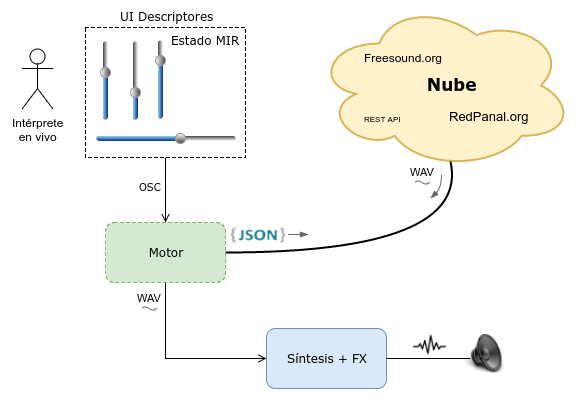

Spanish version: [README_es.md](README_es.md)

# About the project

APICultor born to realize interdisciplinary performances based on sounds of the web platform [http://redpanal.org](http://redpanal.org). The system is also useful to use with any other sound database on the internet or even running it locally.

Sound is processed digitally using different live-coding techniques. A pre-analysis based on Music Information Retrieval (MIR) stored in a database and accessed via a web-service REST API is combined with real-time processing and synthesis, random processes and human control via external interfaces.

Examples available with SuperCollider, pyo and pd.




## Performances

### Sonidos Mutantes

Interdisciplinary performances based on sounds of the web platform [Redpanal.org](Redpanal.org)

## Proofs of concept:

* [APICultor + No Input + Granular synthesis performance](https://soundcloud.com/hern-n-ordiales/hard-glitch-trip).

* [Proyecto de reciclado de sonidos libres de la web en RedPanal.org](http://redpanal.org/p/reciclado-de-samples/) (sonido + referencia al original).

* Performances en vivo utilizando estas herramientas:
  * Jam con guitarras + fx chain y sintes analógicos: [Perfo mutante en La Siesta del Fauno](https://soundcloud.com/hern-n-ordiales/perfo-mutante-mobile)
  * Closing performance of the Workshop of Experimental Sound:
[http://redpanal.org/a/banda-de-mutantes-cierre-taller/](http://redpanal.org/a/banda-de-mutantes-cierre-taller/)
  * La Noche de los Museos La Casa del Bicentenario: [Performance 29/10/2016](http://redpanal.org/a/performance-casa-tomada/) [Con visuales 3D (Blender game engine)](https://www.youtube.com/watch?v=eKcvkgtJIEo) ) **Reseña**: [enjambrebit-y-la-banda-de-mutantes/](http://blog.enjambrelab.com.ar/enjambrebit-y-la-banda-de-mutantes/)

* Música generativa con máquina de estados MIR y sonidos libres de Freesound.org: 
  * "[Feature Thinking](https://soundcloud.com/hern-n-ordiales/feature-thinking)" (con sonidos libres Creative Commons de Freesound.org) by hordia.
  * State Machine @ CASo (Centro de Arte Sonoro) https://www.youtube.com/watch?v=sG1YUc8PQV4
  
* Remixes que toman audios libres de [RedPanal.org](http://redpanal.org/) para categorizarlos según diferentes tipos de emociones. Luego se elige una y se sincronizan las pistas, cambiando las tonalidades. De ser posible se separan de fuentes dentro de las mismas (by Mars Crop)
  * [Beats intro jazz](http://redpanal.org/a/sm-beats-remix/)
  * [Bass & DJ] (http://redpanal.org/a/sm-bass-guitar-plays-with-dj/)

* Old demos:
  * Integración con controlador MIDI + Supercollider + ApicultorWebService: [https://www.youtube.com/watch?v=X0M_gTOZnNQ](https://www.youtube.com/watch?v=X0M_gTOZnNQ)


## Components


* Mock web service with API REST to provide audio samples using MIR descriptors as parameters
* State machine, with each state defined by several MIR descriptors.
* Interaction with the free internet sound database [http://redpanal.org](http://redpanal.org)
 * API REST
 * Webscrapping by tag
* Algorithms MIR to extract mean values or by frame of audio samples
* Segmentation algorithms using different criteria.
* Classify algorithms and clustering of samples of the sound database
* Server OSC
* Examples in Supercollider, pyo
* Examples with MIDI and OSC controller. Locale and remote.


# Dependencies

Tested under Linux, Mac OS (>10.11) and Windows 10.

Debian, Ubuntu 15.04 and 16.04 (and .10). And [Docker](docker.md) images.
Raspian @ Raspberry Pi

See [INSTALL.md](INSTALL.md)

## Music Emotion State Machine

```
$ python MusicEmotionMachine.py wherethere'sdata multitag[True/False/None]
```

(True, Classify all downloaded sounds in a directory. After classification has been performed, you must run again with the multitag option in False or None to call Johnny (the Music Emotion State Machine) to start emotional transitions and start the remix

To remix we use (from Deep Learning results) classification data to make emotive remixes and the decision variables to reconstruct scratching movements. We also emphasize on components searching (using a method to find out how many possible sound sources can be found) to generate simple remixes, where sound a can just take the beat and sound b has the harmonic role. We provide ourselves of many utilities (scratching methods, segmentations, etc) to make fun remixes

### About the Music Emotion Machine's Deep Learning:

Since we aim to classify all the sounds in RedPanal based on emotions, our task is to review activations in many runs using layers of support vector machine (this is known as Multi-Layer SVMs or Deep SVMs). By the time we only find four emotions in music. As the MIR information is important for all the other tasks, we do our best to respect the data we have, this allows us to review everything the best possible way. This is why we use Cross Validation and other tools to get the best information.

## Docker

See [docker](docker.md) and [Dockerfile](Dockerfile.md).


API listening in port 5000:
```
$ docker build -t apicultor_v0.9 .
$ docker run -p 5000:5000 --name apicultor  -it --net="host"  apicultor_v0.9
```
