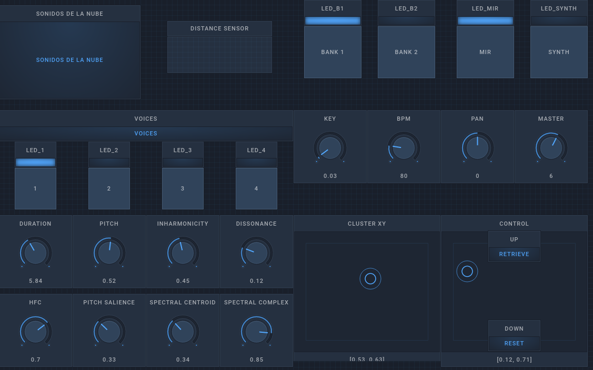

English version: [README.md](README.md)

# Sobre el proyecto
* __DEMO__ interactiva: [Experimental session with sounds from the cloud](https://www.youtube.com/watch?v=2sMsKvfZKGA) ([youtube link](https://www.youtube.com/watch?v=2sMsKvfZKGA))
* Instrumento embebido corriendo en raspberry pi: [raspicultor](https://github.com/hordiales/raspicultor).
* Mención como "Instrumento basado en sonidos de la Nube" en el [premio ArCiTec](https://arcitec.frba.utn.edu.ar/tecnologia-aplicada-al-arte/) categoría Tecnología aplicada al Arte (2018).
* Publicación en [Audio Mostly](http://audiomostly.com): [Sound recycling from public databases](https://www.researchgate.net/publication/317388443_Sound_recycling_from_public_databases) (2017) 
* "Forgotten pieces from unknown people" and "Dialectic in suspense" constructed using APICultor, were showed in [NIPS 2017 Art Gallery](http://nips4creativity.com/music/) (Machine Learning for Creativity and Design, Long Beach, California, USA)
* El trabajo "Sound recycling from public databases" fue presentado [Technarte Los Angeles 2017](http://www.technarte.org/losangeles-2017-program/).
* Sonidos reciclados en RedPanal.org: [Sound miniatures](http://redpanal.org/p/reciclado-de-samples/)

# Licencia

Software Libre, compartido con GPL v3 ([LICENSE](LICENSE)).

# ¿Qué es?

ApiCultor fue implementado para realizar performances multidisciplinarias basadas en los sonidos de la plataforma [http://redpanal.org](http://redpanal.org) pero sirve para trabajar con cualquier otra base de datos sonora en internet o disponible localmente.

El código da soporte para el procesamiento de sonidos de la web utilizando técnicas de MIR (Music Information Retrieval) para la "extracción" de parámetros que los caractericen para luego clasficarlos, segmentarlos y manipularlos según los criterios elegidos.

Funciona a través de una API REST para la consulta externa de archivos y descriptores desde SuperCollider, pyo, pd o cualquier otro tipo de entorno que maneje protocolos estándar.

Extrae miel de [RedPanal](http://redpanal.org)  con técnicas de Music Information Retrieval (MIR).

## Diseño de Controlador MIDI Custom

[Yaeltex](https://yaeltex.com/en) custom MIDI controllers

Con un sintetizador en SuperCollider corriendo en una Raspberry pi + placa de sonido externa.

## Open Stage Control User Interface version
### UI MIR mode

### UI Synth mode

## API

[Documentación sobre la API](doc/API.md)

## Sonidos Mutantes
*Sonidos Mutantes, propone performances basadas en el uso artístico de bases de datos preexistentes, las mismas construidas por audios o músicas libres, por ejemplo aquellas de la plataforma colaborativa de RedPanal.org, la cuál es de acceso público vía internet. Estos sonidos, analizados y procesados en tiempo real se combinan en una improvisación colectiva con músicos en vivo bajo consignas preestablecidas, dando lugar a composiciones que mutan a lo largo del tiempo y en función de los propios músicos y de la comunidad toda. Ya que el público podrá participar de la performance subiendo audios y haciendo búsquedas o comentarios en la plataforma web de RedPanal.*

### Pruebas de concepto:

* Performances en vivo utilizando estas herramientas:
  * [APICultor + No Input + Granular synthesis performance](https://soundcloud.com/hern-n-ordiales/hard-glitch-trip).
  * Jam con guitarras + fx chain y sintes analógicos: [Perfo mutante en La Siesta del Fauno](https://soundcloud.com/hern-n-ordiales/perfo-mutante-mobile)
  * Cierre de Taller de Experimentación Sonora: [http://redpanal.org/a/banda-de-mutantes-cierre-taller/](http://redpanal.org/a/banda-de-mutantes-cierre-taller/)
  * La Noche de los Museos La Casa del Bicentenario 29/10/2016
[http://redpanal.org/a/performance-casa-tomada/](http://redpanal.org/a/performance-casa-tomada/)
  [https://www.youtube.com/watch?v=eKcvkgtJIEo](https://www.youtube.com/watch?v=eKcvkgtJIEo) Con visuales 3D (Blender + game engine) **Reseña**: [http://blog.enjambrelab.com.ar/enjambrebit-y-la-banda-de-mutantes/](http://blog.enjambrelab.com.ar/enjambrebit-y-la-banda-de-mutantes/)

* Música generativa con máquina de estados MIR y sonidos libres de Freesound.org: 
  * "[Feature Thinking](https://soundcloud.com/hern-n-ordiales/feature-thinking)" (con sonidos libres Creative Commons de Freesound.org)
  * State Machine @ CASo (Centro de Arte Sonoro) https://www.youtube.com/watch?v=sG1YUc8PQV4

* Remixes que toman audios libres de [RedPanal.org](http://redpanal.org/) para categorizarlos según diferentes tipos de emociones. Luego se elige una y se sincronizan las pistas, cambiando las tonalidades. De ser posible se separan de fuentes dentro de las mismas (by Mars Crop)
  * [Beats intro jazz](http://redpanal.org/a/sm-beats-remix/)
  * [Bass & DJ] (http://redpanal.org/a/sm-bass-guitar-plays-with-dj/)

* Demos viejas:
  * Integración con controlador MIDI + Supercollider + ApicultorWebService: [https://www.youtube.com/watch?v=X0M_gTOZnNQ](https://www.youtube.com/watch?v=X0M_gTOZnNQ)

## Componentes

* Mock web service que por medio de una API REST provee samples según criterios definidos por valores de descriptores MIR
* Máquina de estados según descriptores MIR
* Interacción con sonidos de [http://redpanal.org](http://redpanal.org)
 * API REST para realizar consultas sobre redpanal (url audios+valores de descriptores)
 * Webscrapping por tag
* Algoritmos MIR para extraer descriptores promedio o por frames de pistas o samples
* Algoritmos para segmentar los archivos de audio con diferentes criterios
* Algoritmos para clasificar y agrupar los archivos de la base de datos de [http://redpanal.org](http://redpanal.org) (clustering)
* Server OSC
* Ejemplos de uso con Supercollider, pyo
* Ejemplos con controladores MIDI y OSC. Locales y remotos.

Ver la [descripción de archivos](FILES_DESC.md) para más detalles.

# Dependencias

Tested under Linux, Mac OS (>10.11) and Windows 10.

Debian, Ubuntu 15.04 and 16.04 (and .10). And Docker images.
Raspian @ Raspberry Pi

Ver [INSTALL.md](INSTALL.md).

# Uso

Leer [Instrucciones de uso](doc/Uso.md).
