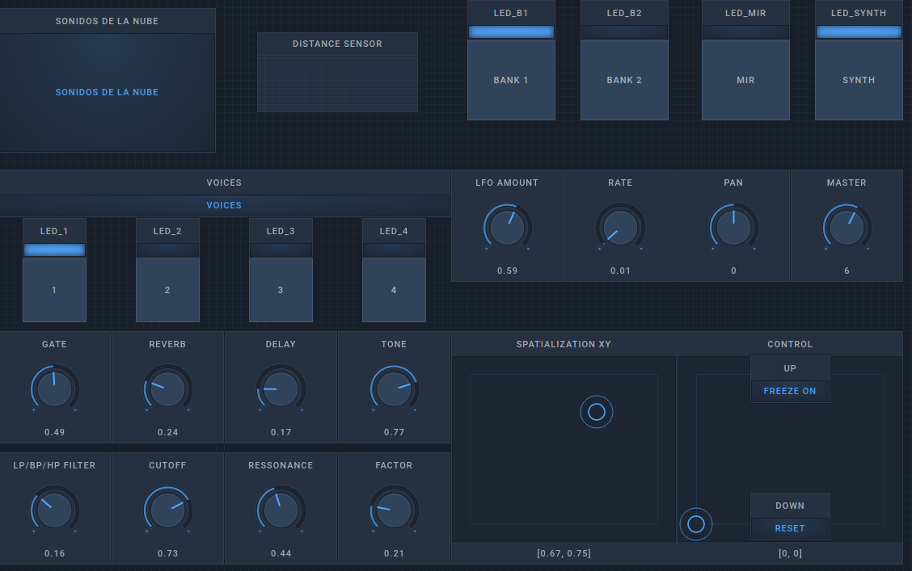

# Usage

* Install dependencies (Linux, MacOS, Windows or raspberry pi)
* Create a config file with Freesound api key (or config another database service)

    For Freesound: [APIv2 APPLY](http://www.freesound.org/apiv2/apply/)
    (and use this callback https://www.freesound.org/home/app_permissions/permission_granted/)
    And we get something like:
        API_KEY = "asga2823235r48qklasdjl3khfasdflk2"

    Then create a file named ".config.json" in the cloud_instrument/ path:
        {
            "sound.synth": "supercollider",
            "api": "freesound",
            "Freesound.org": [
                { "API_KEY": ""
                }
            ]
        }

* Run ./CloudInstrument.py
* If you are going to use SuperCollider run first. Note: sends broadcast OSC message to the network.
    $ sclang -D apicultor_synth.scd
* Run OpenStageControl with ui/apicultor-ui.json (osc receiving port 7000)
* Play with it! Describe sounds with MIR descriptor search them in the Cloud, then use integrated realtime processes with them (granular synth, reverb, delay, LP/HP filters, etc).

 Dependencies: [INSTALL.md](INSTALL.md)

## License

Free Software shared with GPL v3, see [LICENSE](LICENSE).

# Use

# FX Chain

        freeze -> vibrato -> pan-> pithshift -> filters -> delay -> reverb

### Linux: jackd-no-disconnect-config 
~/.jackdrc

    /usr/local/bin/jackd -P75 -t2000 -dalsa -dhw:S2 -p4096 -n7 -r44100 -s

### UI
[Open Stage Control](https://osc.ammd.net/) User Interface

## (optional) Custom MIDI Controller

[Yaeltex](https://yaeltex.com/en) custom MIDI controllers

With a SuperCollider synthesizer/effects processor running in a Raspberry pi, plus an external sound card for high fidelity.

### MIR mode

### Synth mode

