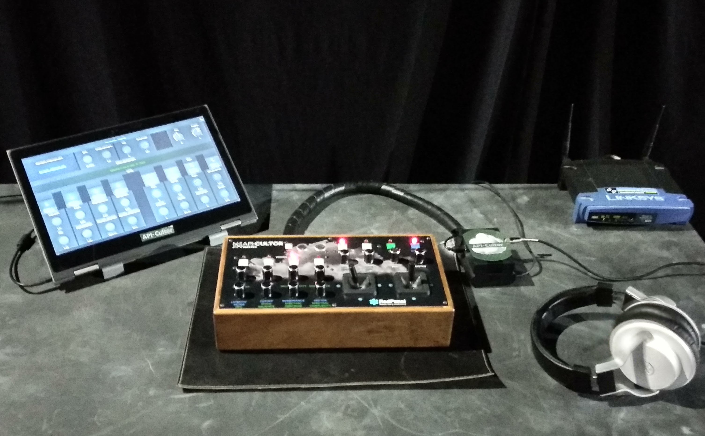

# Raspicultor

Custom MIDI Controller plus a Raspberry pi running Supercollider synthesizer/effects processor. Using an external USB sound card for high fidelity.

Build by [Yaeltex](https://yaeltex.com/en) custom MIDI controllers

## How to perform with it?

See the [User Guide](User-Guide.pdf) for more details.

## Configuration

* Install dependencies (Linux, MacOS, Windows or raspberry pi)
* Create a config file with Freesound api key (or another database service)
        {
            "sound.synth": "supercollider",
            "api": "freesound",
            "Freesound.org": [
                { "API_KEY": ""
                }
            ]
        }

* Run ./CloudInstrument.py
* If you are going to use SuperCollider run first. Note: sends broadcast OSC message to the network.
    $ sclang -D apicultor_synth.scd
* Run OpenStageControl with ui/apicultor-ui.json (osc receiving port 7000)
* Play with it! Describe sounds with MIR descriptor search them in the Cloud, then use integrated realtime processes with them (granular synth, reverb, delay, LP/HP filters, etc).

 Dependencies: [INSTALL.md](INSTALL.md)

# Use

# FX Chain

        freeze -> vibrato -> pan-> pithshift -> filters -> delay -> reverb

### Linux: jackd-no-disconnect-config 
~/.jackdrc

    /usr/local/bin/jackd -P75 -t2000 -dalsa -dhw:S2 -p4096 -n7 -r44100 -s

### (optional) External UI for visual feedback

Running a browser in an external computer, tablet, mobile phone, etc.

[Open Stage Control](https://osc.ammd.net/) User Interface

# Art installations

Sounds from the Cloud installation.